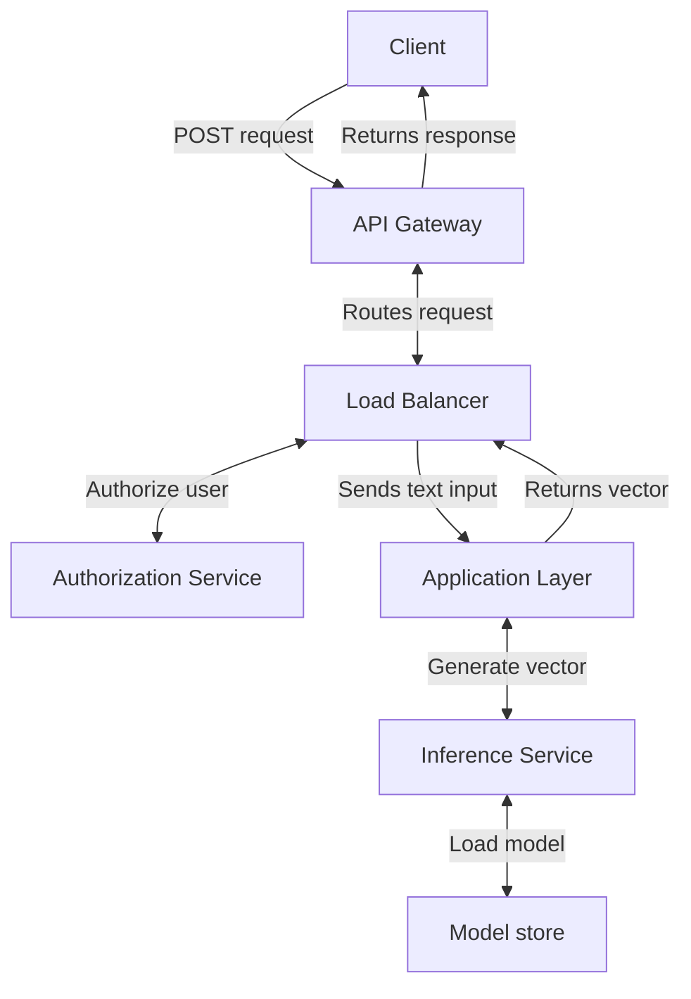

# inference-api

## Usage
The `inference-api` takes a text input and returns an embedding vector as an output.

## Install
Install required packages:

```shell
python -m pip install -r requirements.txt
```

## Run
Activate the API:

```shell
docker run -p 5000:5000 inference-api
```

- NOTE: to run manually: `python src/app.py`.

Send a request:

```shell
curl -X POST -H "Content-Type: application/json" -d '{"text": "hello, world!"}' http://localhost:5000/_inference
```
The API takes the following parameters:
- `text` <str>: input text.
- [optional] `model_name` <str>: Model name to load from huggingface. Default: "bert-base-uncased".

Response:

```shell
{
  "message": "Vector generated",
  "vector": [
    0.1,
    0.2,
    0.3,
    0.4,
    0.5,
    0.6,
    0.7,
    0.8
  ]
}
```

## Project Structure

```
├── Dockerfile
├── README.md
├── requirements.txt
├── src
│   └── app.py
│   └── inference.py
└── test
    └── test_app.py
    └── test_cases.json
```

- `Dockerfile`
: build the docker image.
- `README.md`
: you are here.
- `requirements.txt`
: Install necessary dependencies: `python -m pip install -r requirements.txt`
- `src/`
: python source code for API routing and model inference.
    - `app.py`
    : python code for API routing.
    - `inference.py`
    : python code for model inference.
- `test/`
: `pytest` code for unit testing.


## Application Graph


- The `Client` sends text input as a `POST` request with a `JSON` payload.
    - The request should include a `text` filed and an [optional] `model_name` field.
- The `API Gatway` authorizes the user and routes the request.
- The `Inference Service` generates an embedding vector from the input text.

## Test
Run tests:

```shell
python -m pytest
```

## Docker Image
To build:

```shell
docker build -t inference-api .
```

To run:

```shell
docker run -p 5000:5000 inference-api
```